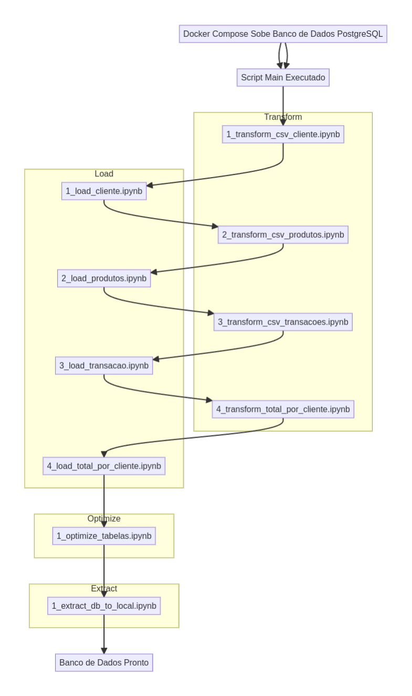

<div align='center'>


</div>

## Objetivo do Projeto.

O objetivo deste teste é avaliar as habilidades técnicas do candidato na manipulação de grandes volumes de dados, desenvolvimento de pipelines, modelagem de dados, otimização de consultas, e compreensão de arquiteturas de dados modernas.

# Proposta do Projeto Teste
### **Parte 1: Construção do Pipeline de Dados**

#### **Descrição**  
**Fonte de Dados**:  
- Um banco de dados PostgreSQL com tabelas simuladas: **transações**, **clientes** e **produtos**.  
- Arquivos CSV fornecidos para dados adicionais.

#### **Requisitos**

1. **Pipeline de Dados:**
   - **1.1**: **Extração** dos dados:
     - Do banco de dados PostgreSQL.
     - Dos arquivos CSV.
   - **1.2**: **Transformação** dos dados:
     - **Normalizar** nomes de clientes (capitalizar).
     - **Corrigir** valores ausentes (exemplo: preço médio para produtos com valores nulos).
     - **Deduplicar** registros.
   - **1.3**: **Criação de Tabela Agregada**:
     - Receita total por cliente.
     - Número total de transações por cliente.
     - Produto mais comprado por cliente.
   - **1.4**: **Carregamento** dos dados transformados:
     - Banco de dados final ou data warehouse (PostgreSQL ou SQLite).

#### **Arquivos Fornecidos**

- **3 arquivos CSV simulados**:
  - **cliente.csv**: id_cliente, nome_cliente, email, telefone.
  - **produtos.csv**: id_produto, nome_produto, ~~categoria~~, preco.
  - **transacoes.csv**: id_transacao, id_cliente, id_produto, quantidade, data_transacao (particionado em 3 zips: transacoes_1, transacoes_2, transacoes_3).
  
- **Script SQL** para criação das tabelas iniciais no PostgreSQL.

---

### **Parte 2: Otimização e Documentação**

#### **Descrição**

- **Otimização**:
  - **Indexação** em tabelas relevantes.
  - **Estratégias de particionamento** ou **paralelização** no processo de transformação.

- **Documentação**:
  - Fornecer **README.md** contendo:
    - Passos para executar o pipeline.
    - Descrição do fluxo de trabalho.
    - Decisões técnicas tomadas e as razões por trás delas.

---

### **Parte 3: Consultas Analíticas**

#### **Descrição**

Crie as seguintes **consultas SQL** no banco de dados final:

- ~~Receita total por categoria de produto.~~
- Top 5 produtos **mais vendidos** em um período de tempo.
- Número de **clientes ativos** (aqueles que realizaram pelo menos 1 compra) nos últimos 3 meses.

**Otimize as consultas** para grandes volumes de dados, explicando as melhorias feitas.

---

### **Entregas Esperadas**

- **Código fonte** do pipeline.
- **Banco de dados final** populado com os dados processados.
- **Consultas SQL**.
- **README.md** com instruções detalhadas para execução.

---

### **Critérios de Avaliação**

#### **Completude Técnica**:
- O pipeline **deve atender** aos **requisitos funcionais**.
- As consultas **devem fornecer** os **resultados corretos**.

#### **Qualidade do Código**:
- **Deve haver** uma **estrutura e organização** adequadas do código.
- **Deve haver** um **tratamento de erros** eficiente.
- O código **deve seguir** as **boas práticas de desenvolvimento**.

#### **Eficiência**:
- O pipeline e as consultas **devem ser otimizados para desempenho**.

#### **Documentação**:
- O **README** **deve fornecer** **instruções claras** e detalhadas.

#### **Criatividade e Inovação**:
- O candidato **deve utilizar** **estratégias diferenciadas** para resolver os problemas.


## ⚙️ Ferramentas Utilizadas

- 🐍 **Python** – Linguagem de programação para manipulação de dados e execução do pipeline.
- 📊 **Pandas** – Biblioteca para manipulação e análise de dados.
- 🐘 **psycopg2** – Adaptador PostgreSQL para Python, utilizado para comunicação com o banco de dados.
- 🛠 **virtualenv** – Ferramenta para criar ambientes virtuais em Python.
- ⚡ **SQLAlchemy** – Biblioteca para trabalhar com bancos de dados SQL de forma mais eficiente.
- 🐋 **Docker** – Utilizado para rodar containers de ambiente e banco de dados.
- 🐘 **PostgreSQL (Docker)** – Banco de dados relacional utilizado no projeto.
- ⚡ **SQL** – Para consultas e manipulação dos dados.
- 📝 **nbconvert** – Ferramenta para converter notebooks Jupyter em outros formatos.
- ⚙️ **os** – Módulo Python para interagir com o sistema operacional.
- 🔄 **subprocess** – Módulo Python para executar processos no sistema operacional.


## 📂 Estrutura de Diretórios

```bash
### Descrição dos Diretórios

- **data/**: Contém scripts SQL para configuração do banco de dados.
  - `setup.sql`: Script de configuração inicial do banco de dados.
  - `setup.sql_teste_com otimizacao.txt`: Script de configuração para testes com otimização.

- **ETL/**: Contém o código principal do processo ETL.
 
## Descrição dos Notebooks

### 1_extract/
- **1_extract_db_to_local.ipynb**: Notebook responsável por extrair dados de um banco de dados e salvá-los localmente.

### 2_transform/
- **1_transform_csv_cliente.ipynb**: Transformação de dados de clientes.
- **2_transform_csv_produtos.ipynb**: Transformação de dados de produtos.
- **3_transform_csv_transacoes.ipynb**: Transformação de dados de transações.
- **4_transform_total_por_cliente.ipynb**: Transformação para calcular o total por cliente.

### 3_load/
- **1_load_cliente.ipynb**: Carregamento de dados de clientes.
- **2_load_produtos.ipynb**: Carregamento de dados de produtos.
- **3_load_transacao.ipynb**: Carregamento de dados de transações.
- **4_load_total_por_cliente.ipynb**: Carregamento do total por cliente.

### 4_optimize/
- **1_optimize_tabelas.ipynb**: Notebook responsável por otimizar as tabelas de dados.

### output_notebooks/
- **(notebooks gerados após execução)**: Diretório onde os notebooks gerados após a execução são salvos.

### main.py
- **main.py**: Script principal que orquestra a execução dos notebooks, substituindo chamadas de `input()` por um valor padrão e executando os notebooks em sequência.

  - **data_from_db/**: Diretório para armazenar dados extraídos do banco de dados.
  - **final_data/**: Diretório para armazenar dados finais após transformação e otimização.
  - **raw_data/**: Diretório para armazenar dados brutos.

- **image/**: Contém imagens utilizadas no projeto.
  - `logo-magazord.png`: Logo da Magazord.

- **queries/**: Diretório para armazenar consultas SQL.
```

## Requisitos
Para executar este projeto, você precisará dos seguintes requisitos:

- Python 3.x
- Bibliotecas listadas em `requirements.txt`
- Docker (para uso com `docker-compose.yml`)


# 📍 Escopo dos processos realizados no projeto



## 📥 Como Rodar o Projeto

### 1️⃣ Clone o repositório

Primeiro, faça o clone do repositório:

```bash
git clone https://github.com/DuxAlex/
```

### 2️⃣ Verifique se o Docker está instalado

Certifique-se de que o Docker está instalado no seu computador. Para verificar, execute:

```
docker --version
```

Se não estiver instalado, siga a [a documentação do docker](https://docs.docker.com/engine/install/) para realizar a instalação.

### 3️⃣ Verifique se o Python está instalado

Verifique se o Python está instalado:

```
python --version
```

Se não estiver instalado, siga a [a documentação do python](https://www.python.org/downloads/) para realizar a instalação.

## 4️⃣ Instale o `virtualenv`:

  ```bash
  ### Ambiente Virtual
  pip install virtualenv
  ```

## 5️⃣ **Crie o ambiente virtual**:

  ```bash
  virtualenv .venv
  ###ou
  python3 -m venv .venv
  ```

## 6️⃣ **Ative o ambiente virtual**:

  - **No Linux**:
    
    ```bash
    source .venv/bin/activate
    ```
    
  - **No Windows**:
    
    ```
    venv\Scripts\activate
    ```

## 7️⃣ **Instale as dependências do projeto**:

  ```bash
  pip install -r requirements.txt
  ```

## 8️⃣ **Subindo o Docker Compose:**

Depois de executar os scripts, agora é necessário subir os contêineres usando o Docker Compose. 

na raiz do diretório digite:

```bash
 docker compose up -d
```

verifique a situação dos containers digitando:

```bash
docker ps
```
e também:
```bash
docker logs 
```
## 9️⃣ **Execute o scritp principal de TLE (Transform, Load & Extract)**

Entre no diretório ETL usando:

```bash
cd ETL/
```
e Execute o script principal a qual está que puxa todos os outros scritps de execução de forma automatizada:
```bash
python main.py
```

#### ✅ Após estes passos o banco de dados já estará no ar, populado, otimizado, com uma tabela adicional para facilitação das consultas e pronto para consulta. 
---

# Consulta no banco de dados
Aqui você verá como fazer consultas no banco de dados utilizando os scritps ja prontos no diretório queries ou se conectando no banco via dbeaver e a extensão mysql do vscode.

## Estrutura de Diretórios e Arquivos de Consultas

Esta pasta contém os scripts e arquivos de consulta SQL para interagir com o banco de dados. 
Os arquivos Python são utilizados para executar as consultas SQL e realizar as operações necessárias.
```
Estrutura do Diretório:
├── leiame.txt                           # Arquivo de documentação geral sobre o conteúdo da pasta
├── n_clientes_ativos_3meses copy.py     # Script Python para executar a consulta sobre clientes ativos nos últimos 3 meses
├── n_clientes_ativos_3meses.sql         # Arquivo SQL com a consulta para obter o número de clientes ativos nos últimos 3 meses
├── top_5_vendidos_por_período.py        # Script Python para executar a consulta sobre os 5 produtos mais vendidos por período (ano)
└── top_5_vendidos_por_período.sql       # Arquivo SQL com a consulta para obter os 5 produtos mais vendidos por ano
```

## Descrição dos Arquivos:

1. **leiame.txt**:
    - Este arquivo contém uma breve explicação sobre a pasta, como utilizar os scripts, dependências necessárias e outras informações gerais. 
    - Sua função é orientar os desenvolvedores ou usuários sobre a estrutura e os objetivos da pasta.

2. **n_clientes_ativos_3meses.sql**:
    - Este arquivo contém uma consulta SQL que calcula o número de clientes ativos nos últimos 3 meses.
    - A consulta considera a tabela de transações e utiliza a data de transação para identificar os clientes ativos no período desejado.

3. **n_clientes_ativos_3meses.py**:
    - Este script Python é responsável por executar a consulta SQL presente em **n_clientes_ativos_3meses.sql**.
    - Ele se conecta ao banco de dados, executa a consulta e retorna o resultado, podendo ser adaptado para outras operações de análise dos dados.

4. **top_5_vendidos_por_período.sql**:
    - Este arquivo contém a consulta SQL que retorna os 5 produtos mais vendidos por ano, considerando as transações de 2020 a 2024.
    - A consulta utiliza a função `RANK()` para classificar os produtos por volume de vendas e filtra os 5 mais vendidos por ano.

5. **top_5_vendidos_por_período.py**:
    - Este script Python é responsável por executar a consulta SQL presente em **top_5_vendidos_por_período.sql**.
    - O script se conecta ao banco de dados, executa a consulta, processa os resultados e pode gerar relatórios ou gráficos baseados nos dados obtidos.

## Como Usar:

1. **Execução das Consultas**:
    - Para executar as consultas SQL, basta rodar o script Python correspondente. Os scripts Python cuidam da conexão com o banco de dados, execução das consultas e manipulação dos resultados.

2. **Dependências**:
    - As dependências para rodar os scripts Python incluem bibliotecas como `psycopg2` ou `SQLAlchemy` para a interação com o banco de dados.

3. **Personalização**:
    - Caso seja necessário ajustar a consulta SQL, basta modificar os arquivos `.sql`. Qualquer alteração nas consultas pode ser testada diretamente nos scripts Python correspondentes.

4. **Resultado**:
    - Os scripts Python irão retornar os resultados das consultas em formato de tabelas.

Basta executar no terminal:
```bash
### Entre no diretório onde se encontra os scripts de consulta.
cd queries/

### Após isto execute no terminal

### Para consultar o numero de clientes ativos nos ultimos 3 meses.
python n_clientes_ativos_3meses.py
### Para consultar o top 5 produtos mais vendidos por periodo em anos.
python top_5_vendidos_por_período.py
```


## 🔌 Conectando ao Banco de Dados

Para facilitar a interação com o banco de dados e realizar consultas SQL, recomendamos utilizar ferramentas como o **DBeaver** ou a extensão **MySQL** do VSCode, chamada **Weijan Chen** disponível no [Marketplace do VSCode](https://marketplace.visualstudio.com/items?itemName=weijanchen.database-client).

### 🔧 Usando o DBeaver:

1. Instale o DBeaver [aqui](https://dbeaver.io/download/).
2. Abra o DBeaver e crie uma nova conexão PostgreSQL.
3. Preencha os detalhes da conexão com as seguintes configurações:
   - **Host**: `localhost` OU `127.0.0.1`
   - **Porta**: `5432`
   - **Banco de Dados**: `magazord`
   - **Usuário**: `magazord_user`
   - **Senha**: `magazord`
4. Conecte-se ao banco de dados e comece a executar as consultas.

### 💻 Usando a Extensão MySQL no VSCode:

1. Instale a extensão **Database Client** de Weijan Chen no VSCode.
2. Adicione uma nova conexão no painel de conexões.
3. Use as configurações de conexão para o banco de dados PostgreSQL, da mesma forma que faria no DBeaver.
4. Acesse a pasta `db` para consultar os scripts SQL e execute as consultas diretamente no VSCode.

Essas ferramentas vão facilitar a visualização, manipulação e execução de consultas SQL diretamente no banco de dados.

# Possíveis Bugs e Soluções

Esta parte do documento descreve alguns bugs que podem ocorrer no projeto e como resolvê-los.

---

## 1. Problemas ao Subir o Banco de Dados via Main

**Descrição:**
Ao subir o banco de dados utilizando o script principal (`main.py`), podem surgir erros que impedem a execução completa das etapas de ETL.

**Solução:**
- Caso ocorra algum erro, execute os scripts separadamente na seguinte ordem:
  
  1. **Transformação**: Execute os notebooks localizados no diretório `2_transform`.
  2. **Carga**: Execute os notebooks localizados no diretório `3_load`.
  3. **Extração**: Execute os notebooks localizados no diretório `1_extract`.
  
      **obs. :** Para subir o Load corretamente, é nescessário que todos os processos do diretório `2_transform` estejam executados corretamentes os csv prontos estejam corretamentes salvos no diretório `final_data`.

---

## 2. Bug ao Popular ou Atualizar o Banco de Dados com `REPLACE`

**Descrição:**
Ao tentar popular ou atualizar o banco de dados utilizando a instrução SQL `REPLACE`, erros podem ocorrer, como:
- Violação de chaves primárias.
- Perda de registros relacionados.

**Solução:**
- Revise os índices e chaves primárias para garantir que estão configurados corretamente.
- Antes de executar a operação `REPLACE`, certifique-se de que os dados existentes sejam removidos ou atualizados manualmente para evitar conflitos.
- Em caso de persistencia do BUG, drop a tabela e suba novamente conforme a tabela dropada e utilizando separadamente o script da tabela no diretório `3_load`
- Se necessário, utilize `INSERT ... ON CONFLICT` para resolver conflitos de maneira controlada.

---

## Recomendação Geral

Mantenha o ambiente de desenvolvimento bem documentado e teste cada etapa separadamente antes de executá-las no ambiente de produção. Isso reduzirá o risco de falhas e facilitará a identificação de erros.


## 📚 Informações Adicionais

Na pasta `help`, você encontrará uma série de informações úteis que podem te ajudar a compreender melhor os dados utilizados no projeto. Essas informações incluem: 
- **help/**: Contém notebooks e arquivos de ajuda.
  - `ajuste_ids_csv.ipynb`: Notebook para ajuste de IDs em arquivos CSV.
  - `estrutura dos CSVs e do DB.txt`: Descrição da estrutura dos arquivos CSV e do banco de dados.
  - `objetivo.md`: Documento descrevendo o objetivo do projeto.
  - `teste_conexao_db.ipynb`: Notebook para testar a conexão com o banco de dados.
  - `teste_diretorios.ipynb`: Notebook para testar diretórios.
  - `teste_pandas.ipynb`: Notebook para testar funcionalidades do Pandas.
  - `verifica_otimização.ipynb`: Notebook para verificar otimizações.

## Contribuição
### Para contribuir com este projeto, por favor, siga os passos abaixo:

1. Faça um fork do repositório.
2. Crie uma branch para sua feature (git checkout -b feature/nova-feature).
3. Commit suas mudanças (git commit -m 'Adiciona nova feature').
4. Faça um push para a branch (git push origin feature/nova-feature).
5. Abra um Pull Request.

📧 Caso tenha sugestões ou feedbacks, entre em contato:  

- **E-mail**: [alexkrypto.ti@gmail.com](mailto:alexkrypto.ti@gmail.com)  
- **LinkedIn**: [Alex Miqueias](https://www.linkedin.com/in/alexmiqueias/)
<div align="left">
    
</div>


Agradeço por sua atenção e interesse neste projeto! 😊

---

